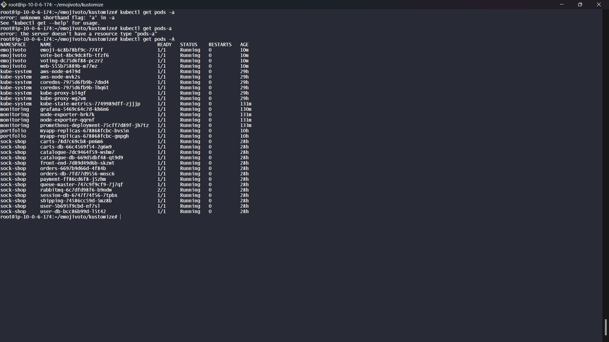

## A CI/CD deployment of web apps to an Amason EKS cluster with monitoring and logging set up on prometheus and grafana.
---

### Prerequisites: 
- make sure ansible is installed and your host machine should be a linux machine, ideally an ubuntu machine.
- github PAT should also be created for your github account with all repository permissions.

- clone this repository

- cd into the **ansible** directory and run `ansible-playbook main.yml`. This would install all the required software on your host machine.

you can visit the various webapps:

- [sock-shop.ktaltproject.me](http://sock-shop.ktaltproject.me) - socks shop
- [webapp.ktaltproject.me](http://webapp.ktaltproject.me) - webapp
- [prometheus.ktaltproject.me](http://prometheus.ktaltproject.me) - prometheus monitoring
- [grafana.ktaltproject.me](http://grafana.ktaltproject.me) - grafana monitoring 

 run `kubectl get pods -A` to get a list of all running pods:

